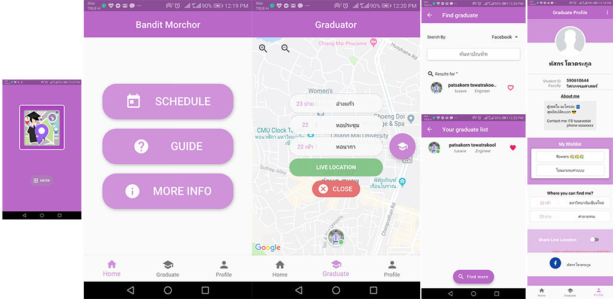

# Bundit CMU 61 🎓

สัปดาห์งานรับปริญญา มหาวิทยาลัยเชียงใหม่ ปีการศึกษา 2561 👨‍🎓👩‍🎓

`หลายสัปดาห์ที่ผ่านมาทางผม ทีมงาน และภาควิชาวิศวกรรมคอมพิวเตอร์ ได้มีแผนที่จะพัฒนาแอพพลิเคชั่น เพื่อที่จะมาใช้ในงานรับปริญญานี้`

## ทำอะไรได้บ้าง ✔🎯

- บอกรายละเอียดงาน กำหนดการ และรายละเอียดต่างๆ
- ผู้ใช้ทั่วไปสามารถดูสถานที่ของบัณฑิตที่ท่านกดถูกใจ ทั้ง สถานที่นัดหมาย และ สถานที่ Live Location ล่าสุดที่บัณฑิตแชร์
- บัณฑิตสามารถกรอกเพิ่มและแก้ไขรายละเอียดส่วนตัว สถานที่นัดพบ เวลา GPS และ Live Location

**_ Now only available for Android 📱 _**

## How to use 📝

1 ติดตั้งแอพพลิเคชั่น

- # Android: [Play Store](https://play.google.com/store/apps/details…)

2 เข้าแอพพลิเคชั่น เลือก Role ของท่าน

1. บัณฑิต
   (กรุณาระบุข้อมูลจริง เพื่อการนำไปแสดงผลที่ถูกต้อง)

- Login with Facebook
- กรอกข้อมูลส่วนตัวเพิ่มเติม
- เพิ่มสถานที่นัดหมายและเวลา

2. บุคคลทั่วไป

- ค้นหาบัณฑิตของท่าน กดติดตาม และไปแสดงความยินดีกันได้เลย ❤

## Screenshots 📷

## Read before ❗

- แอพพลิเคชั่นนี้ทำขึ้นมาเนื่องในโอกาสการแสดงความยินดีกับบัณฑิตทุกท่าน ไม่ได้มีจุดประสงค์ใช้แสวงหาผลประโยชน์เชิงพาณิชย์
- แอพพลิเคชั่นนี้มีการเข้าถึงข้อมูลเบื้องต้นของท่าน
- แอพพลิเคชั่นนี้มีการเข้าถึงสถานที่ตั้งของท่าน กรณีที่ท่านเปิดการแชร์ Live Location บุคคลอื่นสามารถเข้าถึงข้อมูลนี้ได้ หากไม่ต้องการ กรุณาปิดการแชร์นี้
- หากท่านออกจากระบบ ข้อมูลทั้งหมดของท่านจะสูญหาย
- หัดทำ แอพไม่ได้เทพอะไร อย่ายิงนะครับ Please :'(

# ❓

หากเจอปัญหาการใช้งาน หรืออยากเสนอแนะการใช้งาน สามารถ comment เข้ามาได้เลยฮะ

หรือ ติดต่อโดยตรง inbox ได้เลยครับ 🤓
